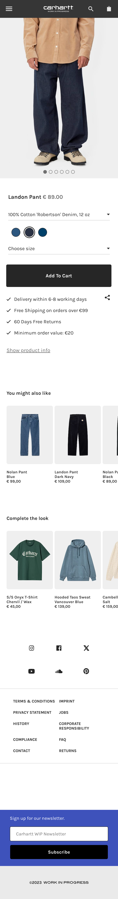
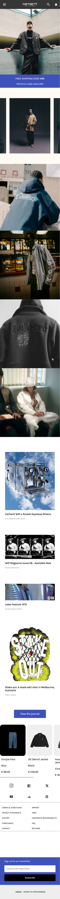
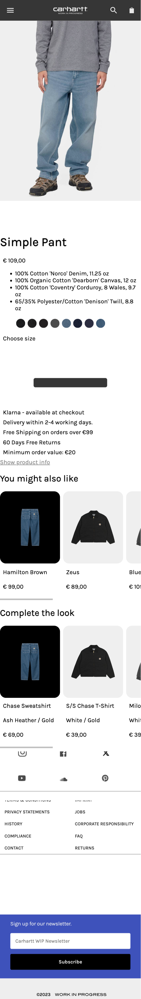

# Procesverslag
Markdown is een simpele manier om HTML te schrijven.  
Markdown cheat cheet: [Hulp bij het schrijven van Markdown](https://github.com/adam-p/markdown-here/wiki/Markdown-Cheatsheet).

Nb. De standaardstructuur en de spartaanse opmaak van de README.md zijn helemaal prima. Het gaat om de inhoud van je procesverslag. Besteedt de tijd voor pracht en praal aan je website.

Nb. Door *open* toe te voegen aan een *details* element kun je deze standaard open zetten. Fijn om dat steeds voor de relevante stuk(ken) te doen.

## Jij

  
uitwerken voor kick-off werkgroep

  ### Auteur:
  Helena Breteler

  #### Je startniveau:
  rood en blauw

  #### Je focus:
  surface plane
 

## Je website

  
uitwerken voor kick-off werkgroep

  ### Je opdracht:
  link naar de website die je gaat namaken óf de naam/omschrijving van je eigen ontwerp
  
  https://www.carhartt-wip.com/en/men-pants-work/simple-pant-blue-light-true-washed-1817_1
  
  https://www.carhartt-wip.com/en/men-pants-work/simple-pant-blue-light-true-washed-1817_1

  #### Screenshot(s) van de eerste pagina (small screen): 
  hier de naam van de pagina  
  

  #### Screenshot(s) van de tweede pagina (small screen):
  hier de naam van de pagina  
  
 

## Toegankelijkheidstest 1/2 (week 1)

  
uitwerken na test in 2e werkgroep

  ### Bevindingen
  Lijst met je bevindingen die in de test naar voren kwamen:
  De voice over gaat eerst de header langs ook op volgorde enb laat meteen weten dat je op de carhartt website bevind.
  Bij de iconen gaat die ze ook op volgorde langs, maar leest hij ook 'afbeelding', dat het een afbeelding is kan overgeslagen worden.
  Flag of the knop groep zegt hij een paar keer. onduidelijk of die de nav leest of de home pagina langs gaat.
  Hij leest de nav buiten beeld voor, per categorie. zou fijn zijn als die eerst 'men' women' etc voorleest dan 'men' en alles wat daaronder/daar in valt.
  Koppen begint bij de nieuwsletter, beetje gek vind ik. dit is ook de enige kop in de hele home pagina.
  

## Breakdownschets (week 1)

  
uitwerken na afloop 3e werkgroep

  ### de hele pagina: 
  

  ### dynamisch deel (bijv menu): 
  

  ### wellicht nog een dynamisch deel (bijv filter): 
  

## Voortgang 1 (week 2)

  
uitwerken voor 1e voortgang

  ### Stand van zaken
  hier dit ging goed & dit was lastig (neem ook screenshots op van delen van je website en code)

  ### Agenda voor meeting
  samen met je groepje opstellen

  | Michelle        |
  •⁠  animatie button (in zero state)
  •⁠  ⁠elementen apart aanspreken, lukt vaak wel maar niet altijd
  •⁠  ⁠opbouw zonder sections en div’jes te gebruiken vind ik nog moeilijk
  
  | Tess            |
  •  Flexbox in de header, ik krijg bepaalde elementen niet zoals ik wil
  •  Typografie lukt niet op alle elementen 
  •⁠  ⁠lastig om een opbouw te maken met weinig/geen div’s en classes
  
  | Sabri           |
  •  Hoe moet ik weten welke goede momenten zijn om flexbox en grid toe te passen?
  
  | Helena        |
  • Header recht krijgen met flexbx
  • GitHub link goed hebben staan

  ### Verslag van meeting
  hier na afloop snel de uitkomsten van de meeting vastleggen

  - Header staat goed met flexbox, maar nog niet recht met grid, volgende les
  - Font goed gekoppelt
  - mee gekeken met de bevindingen van de teamgenoten!

## Voortgang 2 (week 3)

  
uitwerken voor 2e voortgang

  ### Stand van zaken
  hier dit ging goed & dit was lastig (neem ook screenshots op van delen van je website en code)

  ### Agenda voor meeting
  samen met je groepje opstellen

  | Michelle        |
  •⁠  
  
  | Tess            |
  •  het lukt niet goed om de header te stylen met flexbox en het werkt niet goed mee
  •⁠  ⁠mijn afbeeldingen op de homepage moeten een lijst zijn waar je doorheen kan scrollen maar het lukt niet helemaal goed
  •⁠  ⁠bij mijn tweede pagina heb ik een background color toegevoegd maar die wordt nu ook toegepast op elementen waarbij ik dat niet wil.
  
  | Sabri           |
  •  Wat is de beste manier om een hamburgermenu te maken?
  
  | Helena        |
  • Hoe kan ik de zoekbalk toevoegen

  ### Verslag van meeting
  hier na afloop snel de uitkomsten van de meeting vastleggen

  - https://codepen.io/shooft/pen/JjxmvrL
  - https://www.a11yproject.com/posts/how-to-hide-content/ (content laten voorlezen maar niet zien)
  

## Toegankelijkheidstest 2/2 (week 4)

  
uitwerken na test in 9e werkgroep

  ### Bevindingen
  Lijst met je bevindingen die in de test naar voren kwamen (geef ook aan wat er verbeterd is):
  • De volgorde van de foto en kopjes omdraaien om duidelijker te maken waar de gebruiker naar kijkt. 

## Voortgang 3 (week 4)

  
uitwerken voor 3e voortgang

  ### Stand van zaken
  hier dit ging goed & dit was lastig (neem ook screenshots op van delen van je website en code)

  ### Agenda voor meeting
  samen met je groepje opstellen

  | Michelle        |
  •⁠  
  
  | Tess            |
  •  Hoe moet de screen reader gebruiken
  
  | Sabri           |
  •  Wat is de beste manier om een hamburgermenu te maken?
  
  | Helena        |
  • socials in grid
  • footer form

  ### Verslag van meeting
  hier na afloop snel de uitkomsten van de meeting vastleggen

  - grijze overlay
  - hover en tab andere kleur voor toegankelijkheid

## Eindgesprek (week 5)

  
uitwerken voor eindgesprek

  ### Je uitkomst - karakteristiek screenshots:
  
  

  ### Dit ging goed/Heb ik geleerd: 
  Korte omschrijving met plaatjes

  - de subscibe voor de newsletter responsive
  - scroll van artikelen toevoegen

    **herkansing**
  - tekst buiten beeld maar wel voor laten lezen door screen reader met a11y !!
  - foto's van detailpagina in carroussel op formaat zetten
  - dropdown - select option value
  - radiobuttons met tag radio, zelfde categorie door zelfde name te geven
  - hide content -
    .visually-hidden {
      clip: rect(0 0 0 0);
      clip-path: inset(50%);
      height: 1px;
      overflow: hidden;
      position: absolute;
      white-space: nowrap;
      width: 1px;
    }
    " class toevoegen aan plek die je niet wilt zien maar wel wilt oplezen.

  
  
  
  
  

  ### Dit was lastig/Is niet gelukt:
  Korte omschrijving met plaatjes

  - Read.me opnieuw schrijven
  - header van detail pagina goed zetten
  - social media logos padding op li gezet ipv op de svg zelf. waardoor de website nog stukje kon scrollen naar de     zijkant.
  

## Bronnenlijst

  
continu bijhouden terwijl je werkt

  Nb. Wees specifiek ('css-tricks' als bron is bijv. niet specifiek genoeg). 
  Nb. ChatGpT en andere AI horen er ook bij.
  Nb. Vermeld de bronnen ook in je code.

  1. <!-- logo in header: svg copy van carhartt-wip.com -->
  2. <!-- button in header: svg copy van carhartt-wip.com -->
  3. <!-- alle foto's: carhartt-wip.com download -->
  5. <!-- bron foto's : https://www.carhartt-wip.com/en/men-pants-work/simple-pant-blue-light-true-washed-1817_1 -->
  6. <!-- bron code carrousels: https://codepen.io/shooft/pen/mdBOZLz -->

